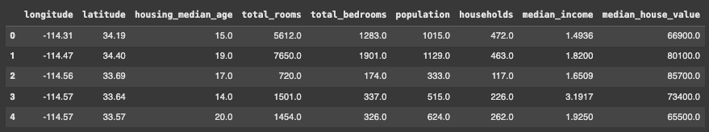

# Introdução à análise exploratória
A análise exploratória é essencial no contexto do machine learning. Antes de construir o modelo em si, é sempre bom examinar o conjunto de dados em que estamos trabalhando. Na linguagem Python existem muitas bibliotecas usadas nessa etapa de manipulação de dados, mas nesse capítulo falarei do **Pandas**: um poderoso aliado do aprendizado de máquina.

## Importação e uso
Para usar a biblioteca no seu código você pode usar:

```python
import pandas as pd # para usar o pandas pela abreviação "pd"
```

Agora já estamos prontos para ver um exemplo do uso do Pandas na manipulação de um arquivo **csv**, muito comum no contexto de ciência de dados. 

```python
file_path = '/caminho/arquivo.csv'
dataframe_with_csv = pd.read_csv(file_path)
```

Explicação: criamos uma variável chamada "dataframe_with_csv", e nela chamamos o método
`read_csv()``
que lê o arquivo csv e cria em um dataframe. Dataframes são estruturas semelhantes a planilhas, e **organizar os dados nessa forma será útil para as operações futuras**.

### Caso o código dê erro
Alguns erros comuns são 
`ParseError: Error tokenizing data. C error: Expected 1 fields`
, ou ainda
`UnicodeDecode Error: 'utf-8' codec can't decode byte 0xcd...`.
Isso pode indicar que os dados contém caractéres incompatíveis com a codificação **utf-8**

Para resolver isso você pode usar alguns argumentos no método read_csv():
```python
dataframe_with_csv = pd.read_csv(file_path, encoding='iso-8859-1', delimiter=';')
```

## Informações estatísticas do dataframes
Agora que vimos como criar um dataframe a partir de um csv podemos ver algumas operações básicas. Uma delas é a visualização com o método 
`describe()`
que mostra alguns valores interessantes sobre nosso conjunto de dados: 

```python
file_path = '/data/california_housing_train.csv' # Um arquivo csv com dados imobiliários
dataframe_with_csv = pd.read_csv(file_path)
dataframe_with_csv.describe()
```
**output:**


As colunas no sentido horizontal (longitude, latitude, etc...) são as colunas do próprio csv, e as colunas no sentido vertical são cálculos feitos pelo próprio Pandas. Essas colunas verticais são importantes para termos uma visão geral dos nossos dados. A seguir explicarei o que cada uma representa:

**- count:** Representa o número de valores não nulos em uma coluna.

**- mean:** A média de uma coluna é a soma dos valores não nulos da coluna dividida pela quantidade de valores não nulos.

**-std:** É o desvio padrão que indica o quão afastados os valores estão da média. Um desvio padrão alto indica que há uma maior variação nos dados, já um desvio padrão baixo indica que os dados estão próximos da média.

**- min:** O valor mínimo encontrado.

**- 25%:** Representa o 1° quartil, ou seja, o valor cujo 25% dos dados estão abaixo. Nesse caso podemos dizer que na coluna longitude 25% dos dados estão abaixo de - 121,79.

**- 50%:** Representa o 2° quartil, ou seja, a mediana. Nesse caso podemos dizer que na coluna longitude uma parte dos dados está abaixo de - 118,49 e a outra parte está acima.

**- 75%:** Representa o 3° quartil, ou seja, o valor cujo 75% dos dados estão abaixo. Nesse caso podemos dizer que na coluna longitude 75% dos dados estão abaixo de - 118.

**- max:** O valor máximo encontrado.

Você deve ter percebido que até agora estamos lidando com dados numéricos, mas o 
`describe()` 
também pode lidar com **dados categóricos** (strings e valores não numéricos). O que muda, nesse caso, é a forma como as informações são exibidas: 

```python
# Criando um novo DataFrame só com variáveis categóricas
data = {'Categoria': ['A', 'B', 'A', 'A', 'C', 'B', 'B', 'C', 'C', 'A']}
df = pd.DataFrame(data)

# Resumo da coluna categórica
print(df['Categoria'].describe())
```

**output:**

```
count     10
unique     3
top        A
freq       4
Name: Categoria, dtype: object
```

## head() e tail()
O Pandas também permite que nós tenhamos acesso as primeiras linhas de um dataframe. Podemos usar a função
`head()` 
para isso:

```python
dataframe_with_csv.head() # usando o dataframe criado inicialmente
```
**output:**


Por padrão o 
`head()`
retorna os 5 primeiros, mas nós podemos adicionar um número inteiro como argumento para retornar a quantidade que quisermos:

```python
dataframe_with_csv.head(6) # os 6 primeiros
dataframe_with_csv.head(10) # os 10 primeiros
dataframe_with_csv.head(15) # os 15 primeiros
```

Já a função 
`tail()`
pega os últimos registros e segue a mesma lógica de uso:

```python
dataframe_with_csv.tail() # os 5 últimos
dataframe_with_csv.tail(6) # os 6 últimos
dataframe_with_csv.tail(10) # os 10 últimos
dataframe_with_csv.tail(15) # os 15 últimos
```