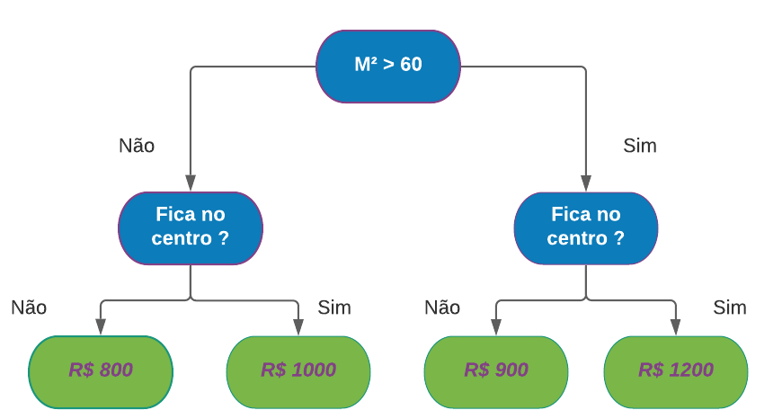

# Primeiros modelos
Anteriormente vimos o uso do **Pandas** para uma análise exploratória básica. A seguir nós veremos a utilidade disso na criação dos nossos primeiros modelos de machine learning.

Para a criação do modelo nós usaremos a biblioteca 
`sklearn` 
(Scikit-learn), do Python. Ela oferece uma gama de ferramentas para ML, tanto para coisas mais simples quanto para modelos mais robustos. 

## Escolhendo modelo
Para os exemplos a seguir, usaremos o modelo 
`DecisionTreeRegressor`
. Uma implementação de árvore de decisão para tarefas de regressão, disponível no sklearn. Em termos simples, uma árvore de decisão é como um conjunto de perguntas encadeadas (ou nós), até que grupos mais homogêneos sejam criados.


Nas tarefas de regressão (como a nossa), as "perguntas" feitas para separar os dados são baseadas em um critério chamado variância. A cada divisão, o modelo tenta reduzir a variância dentro dos grupos, ou seja, ele busca separar os dados de maneira que os valores nas diferentes ramificações da árvore sejam mais próximos entre si. Esse processo de divisão continua até que a variância seja baixa o bastante,formando grupos mais homogêneos. No futuro osso criar um repositório dedicado a árvores de decisão, explicando esses conceito com maior profundidade. 

Podemos usar esse modelo a partir do seguinte código:

```python
# caso você não tenha instalado use: 
# pip install scikit-learn
from sklearn.tree import DecisionTreeRegressor
model = DecisionTreeRegressor(random_state=1)
```

O modelo foi criado e definimos também um 
`random_state=1`.
 **O random_state serve pra garantir a reprodutibilidade dos resultados do modelo**, ou seja, com a mesma base de dados e com o mesmo código, teremos os mesmos resultados. É como se ele "controlasse" a aleatoriedade do modelo.

