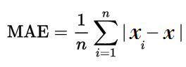

# Predições
[Anteriormente](https://github.com/Marcozz-716/machine-learning-intro/tree/main/03_treinando_modelo) nós vimos como treinar o modelo a partir do nosso conjunto de dados, e nesse capítulo nós vamos aprender como fazer predições com nosso modelo e como avaliar essas predições.

```python
# recapitulando

import pandas as pd
from sklearn.tree import DecisionTreeRegressor

model = DecisionTreeRegressor(random_state=1)

file = 'data/train.csv'
var_independentes = ['LotArea','YearBuilt','1stFlrSF','2ndFlrSF','FullBath','BedroomAbvGr','TotRmsAbvGrd']
df = pd.read_csv(file)

X = df[var_independentes] 
y = df.SalePrice

model.fit(X, y)
```
## predict()
Para fazer as predições nós podemos usar a função 
`predict()` 
, passando como argumento as variáveis independentes. 

```python
predictions = model.predict(X)
```

Em seguida nós podemos ver os resultados e compara-los com o conjunto de dados original.

```python
print(f'predição: {predictions[:5]}') # primeiras 5 predições
print(f'target: {y[:5].values}') # primeiras 5 linhas dos dados originais
```

**output:**

```
predição: [208500. 181500. 223500. 140000. 250000.]
target: [208500 181500 223500 140000 250000]
```

Bem... analisando o output dá pra ter a impressão de que nosso modelo é perfeito, já que as predições estão iguais aos valores que queríamos prever. A questão é que parando pra pensar isso não diz muita coisa. Não faz sentido prever valores já vistos no treinamemto, e é por isso que para avaliar o modelo será necessário fazer mais uma separação nos dados.

## Dados para teste e para treino
Uma boa alternativa é separar dados para treinamento e dados para teste do modelo. O **sklearn** nos dá essa possibilidade por meio da função 
`train_test_split`

```python
from sklearn.model_selection import train_test_split 

train_x, test_x, train_y, test_y = train_test_split(X, y, random_state=1)
```

Esse código basicamente recebe as variáveis independentes e dependentes e as separa entre os dados que serão usados no treinamento **(train_x, train_y)** e os dados usados para testar o modelo **(test_x)**.

Refazendo o treinamento e as predições depois dessa nova separação já podemos ver a diferença:

```python
model.fit(train_x, train_y)
predict = model.predict(test_x)

print(f'predição: {predict[:5]}') # primeiras 5 predições
print(f'target: {test_y[:5].values}') # primeiras 5 linhas dos dados originais
```

**output:**

```
predição: [186500. 184000. 130000.  92000. 164500.]
target: [231500 179500 122000  84500 142000]
```

## Métricas de validação
Já deu pra notar que o desempenho do modelo não é tão perfeito quando tentamos fazer previsões em cima de dados que ele nunca viu, **mas como podemos saber de forma mais precisa o quão distante do alvo os resultados estão?** 

Dá pra imaginar que ficar comparando linha por linha de modo manual não é algo muito eficiente, então para essa tarefa nós usamos as **métricas de validação**. No contexto de machine learning existem diversas métricas, mas nesse capítulo falaremos a respeito do **Mean Absolute Error**, ou Erro Médio Absoluto.

O MAE é calculado **a partir da média da diferença entre os valores previstos e os valores alvo**. Podemos representar isso com a seguinte fórmula:



O sklearn oferece uma implementação disso. Vejamos:

```python
from sklearn.metrics import mean_absolute_error

mean_absolute_error(test_y, predict)
```

**output:**

```
29652.931506849316
```

## Interpretando o MAE
O peso do erro médio absoluto varia de acordo com a média dos dados alvo no nosso dataframe. Uma margem de erro de **R$ 29.652,93** pode parecer algo catastrófico em um contexto onde a média de preços no dataframe é de **R$ 50.000,00**, porém em um contexto onde a média dos preços é de milhões esse MAE é algo pequeno.

No nosso dataframe a média de preços dos imóveis é de **R$ 180.921,19**, então nosso MAE não está tão ruim assim, mas ainda há espaço para melhorias.