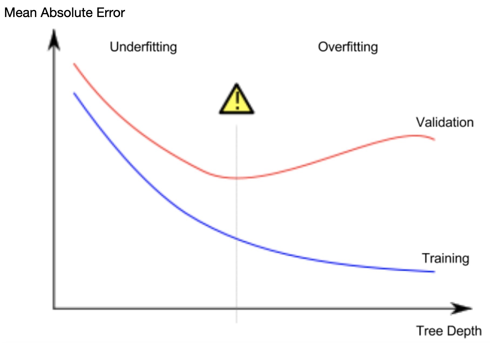

# Overfitting e Underfitting
Quando estamos aprendendo sobre machine learning dois dos conceitos mais temidos são o **overfitting** e o **underfitting**. Ambos são opostos um do outro, mas representam problemas relacionados a forma como o modelo lida com os dados. A seguir será explicada a diferença entre esses conceitos.

## Overfitting
O **Overfitting** se refere a adaptação excessiva de um modelo aos dados de treino, o que provoca uma queda de desempenho em dados que ele não viu. Um modelo em overfitting não tem uma boa capacidade de generalização, pois acaba "decorando" padrões e ruídos muito específicos do conjunto de dados usado em seu treinamento, o que o impede de ter boa performance em novos dados.


## Underfitting
O **Underfitting**, por outro lado, se refere a falta de desempenho de um modelo tanto nos dados de treino quanto nos de teste. Isso geralmente acontece quando o modelo é muito simples e incapaz de capturar padrões, ou quando o conjunto de dados é muito pequeno, ou então quando são escolhidas features com pouca relevância.

## Nosso contexto
No nosso contexto, onde escolhemos usar a 
`DecisionTreeRegressor`
, isso pode se manifestar na relação entre os **parâmetros** do modelo, como a profundidade da árvore, e as características do nosso conjunto de dados, como quantidade e qualidade das features. 

Para identificar se nosso modelo está em underfitting ou overfitting podemos analisar alguns padrões que aparecem no **Erro Médio Absoluto** e na complexidade do modelo.



Se nosso modelo é simples e está tendo um MAE alto tanto no treino quanto no teste podemos dizer que ele está em **underfitting**. Se a complexidade do modelo aumenta e ele tem bom desempenho no treino mas um desempenho ruim no teste podemos dizer que ele está em **overfitting**.

## Otimização de hiperparâmetros
É possível tomar medidas pra melhorar o desempenho dos modelos em um processo chamado de **otimização de hiperparâmetros**. Existem vários hiperâmetros que podemos alterar, mas para o modelo que estamos trabalhando (o DecisionTreeRegressor) nós podemos usar o
`max_leaf_node`
que define o número máximo de nós finais que uma árvore pode ter.

```python
max_size = 100 # usaremos 100 como o número máximo de nós finais
model_test = DecisionTreeRegressor(random_state=0, max_leaf_nodes=max_size)
```

Nesse caso o número 100 foi escolhido **só pra exemplificar**, mas nós podemos encontrar um valor ideal para esse hiperparâmetro. Para fazer isso a gente poderia criar várias árvores com diferentes valores de "max_leaf_nodes", depois veremos qual valor gera um erro médio absoluto menor. 

### Importando novos dados

```python
from sklearn.tree import DecisionTreeRegressor
from sklearn.metrics import mean_absolute_error
import pandas as pd
from sklearn.model_selection import train_test_split

dataset = 'sample_data/california_housing_train.csv' # escolhendo o dataset
dataframe = pd.read_csv(dataset)
dataframe = dataframe.dropna(thresh=3)

features = ['longitude', 'latitude', 'housing_median_age', 'total_rooms', 'total_bedrooms', 'population', 'households', 'median_income']
X = dataframe[features]
y = dataframe.median_house_value
X_train, X_test, y_train, y_test = train_test_split(X, y, test_size=0.2, random_state=42)
```

### Otimizando hiperparâmetro

```python
from sklearn.tree import DecisionTreeRegressor
from sklearn.metrics import mean_absolute_error

max_values = [100, 200, 300, 400]
best_values = [] 

for max_value in max_values:
    model = DecisionTreeRegressor(random_state=0, max_leaf_nodes=max_value)
    model.fit(X_train, y_train)
    y_pred = model.predict(X_test)
    if len(best_values) == 0 or best_values[0] > mean_absolute_error(y_test, y_pred):
        best_values = [mean_absolute_error(y_test, y_pred), max_value]

print("Best MAE:", best_values[0])
print("Best max_leaf_nodes:", best_values[1])
```

### output

```
Best MAE: 41107.58600590038
Best max_leaf_nodes: 300
```
